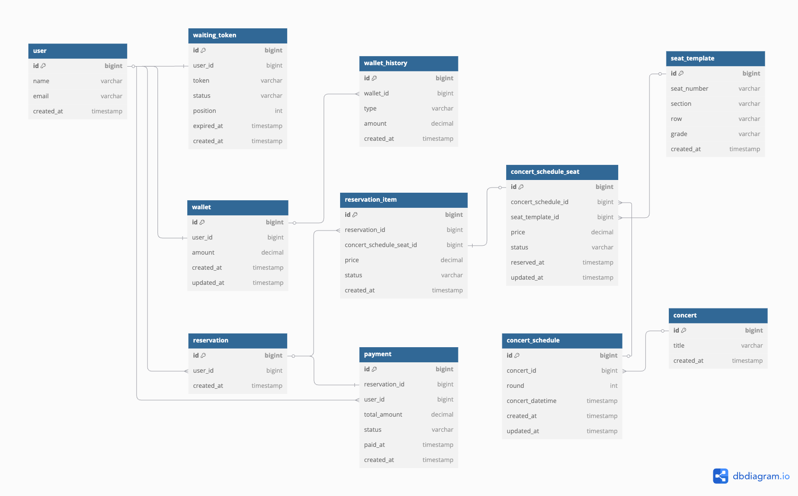

## 🎟 콘서트 예약 서비스

### 📅 마일스톤

[마일스톤 링크](https://github.com/users/uuununew/projects/3/views/4)

### 💭 요구사항 분석
[요구사항 분석 링크](./docs/REQUIREMENTS.md)

### 🔍 시퀀스 다이어그램
[시퀀스 다이어그램 링크](./docs/SEQUENCE.md)

### ➡️ 플로우차트
[플로우차트 링크](./docs/FLOWCHART.md)

### 🔗 ERD
<details>
<summary>ERD</summary>
<div markdown="1">



</div>
</details>

### 📝 API 명세
[SwaggerHub API 문서](https://app.swaggerhub.com/apis-docs/yujinlim-bf9/concert_system_api/v1.0.0#/)


### 인덱스 적용 보고서
[인덱스 최적화 보고서](https://sunrise-sunfish-45d.notion.site/DB-1d7cc24e980180fe948ac908e6ea12be?pvs=4)


### 동시성 제어 보고서
[동시성 제어 보고서](https://sunrise-sunfish-45d.notion.site/1decc24e9801802389cac505382fa35f?pvs=4)


### 캐싱 전략 설계 및 적용 보고서
[캐싱 전략 설계 및 적용 보고서](https://sunrise-sunfish-45d.notion.site/1edcc24e980180768447f07faf7f9f06?pvs=4)


### Redis 기반 랭킹, 비동기 설계 및 구현 보고서
[Redis 기반 랭킹, 비동기 설계 및 구현 보고서](https://uuununew.notion.site/Redis-1f4cc24e980180309dcdf69539090fbd?pvs=4)


### 트랜잭션 설계 진단 및 개선 방안 보고서
[트랜잭션 설계 진단 및 개선 방안 보고서](https://uuununew.notion.site/1facc24e9801800ca411f21ec4da1f85?pvs=4)


### Kafka 학습과 예약 이벤트 처리 보고서
[Kafka 학습과 예약 이벤트 처리 보고서](https://uuununew.notion.site/Kafka-201cc24e9801805eaf81d12e1ea5d132?pvs=4)


<details>
<summary>Running Docker Containers</summary>
<div markdown="1">

#### Running Docker Containers
`local` profile 로 실행하기 위하여 인프라가 설정되어 있는 Docker 컨테이너를 실행해주셔야 합니다.
```bash
docker-compose up -d
```

</div>
</details>