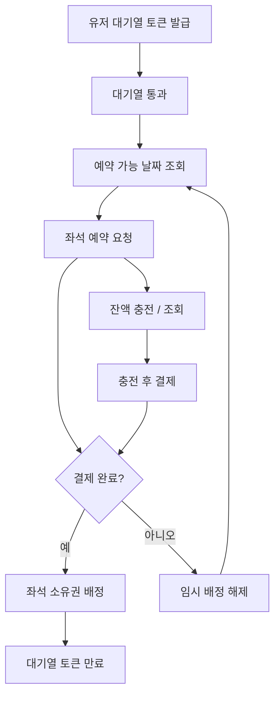

```mermaid
flowchart TD
    A[유저 대기열 토큰 발급] --> B[대기열 통과]
    B --> C[예약 가능 날짜 조회]
    C --> D[좌석 예약 요청]
    D --> E{결제 완료?}
    E -->|예| F[좌석 소유권 배정]
    E -->|아니오| G[임시 배정 해제]
    G --> C
    F --> H[대기열 토큰 만료]
    D --> I[잔액 충전 / 조회]
    I --> J[충전 후 결제]
    J --> E
```