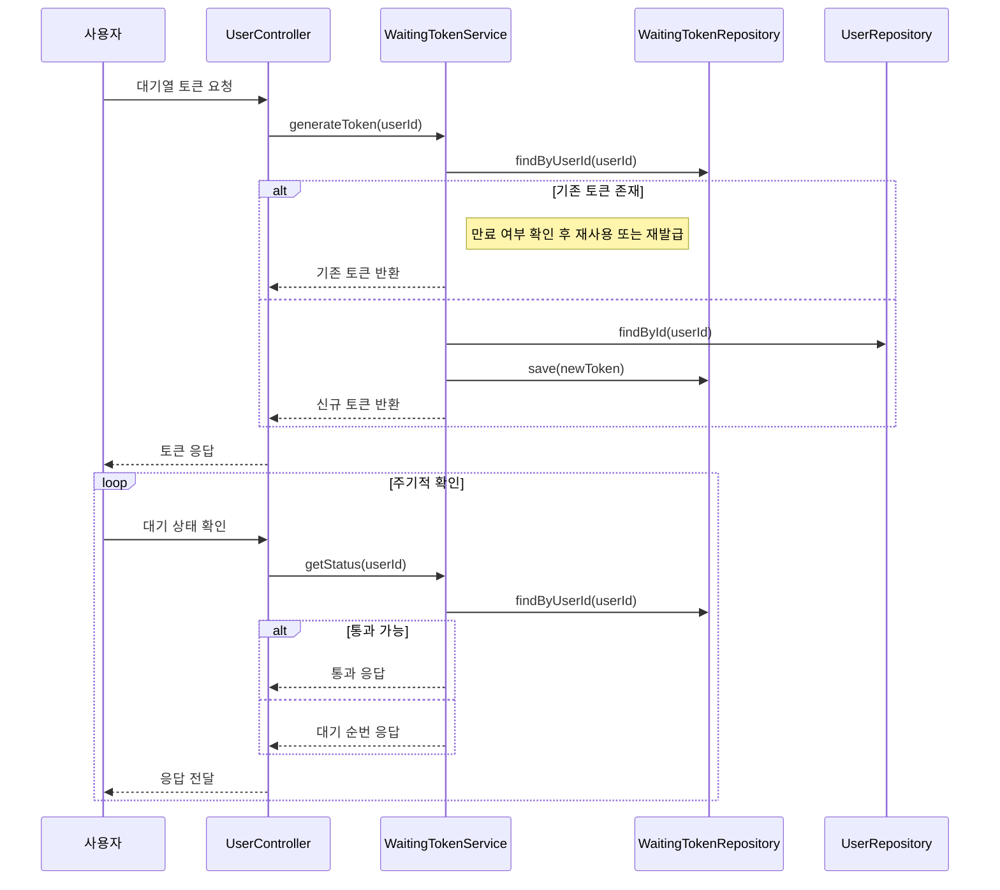
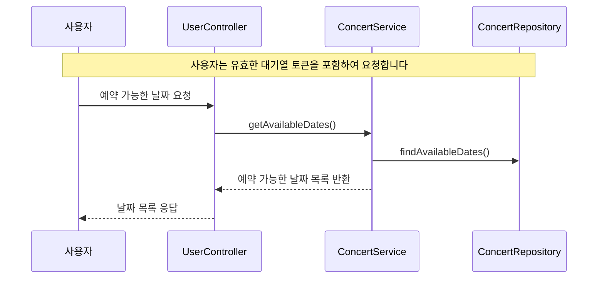
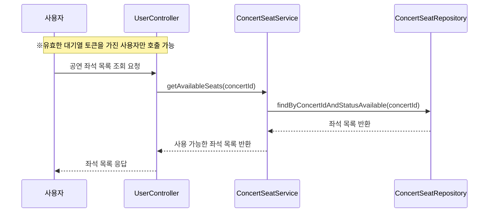
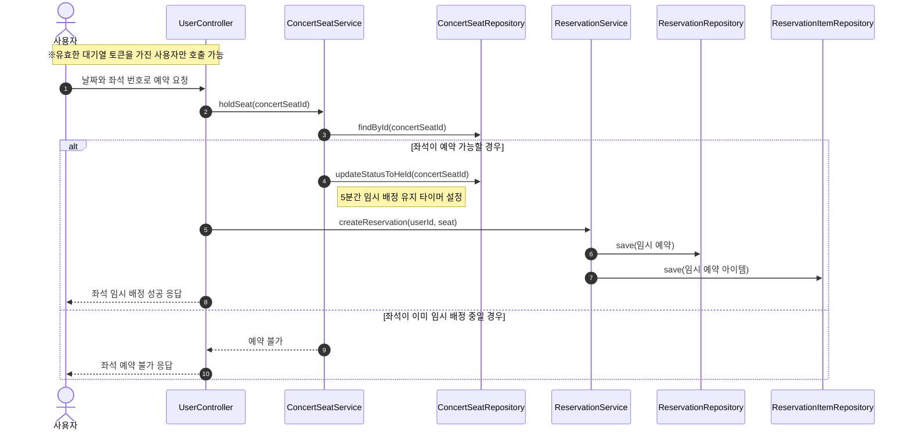
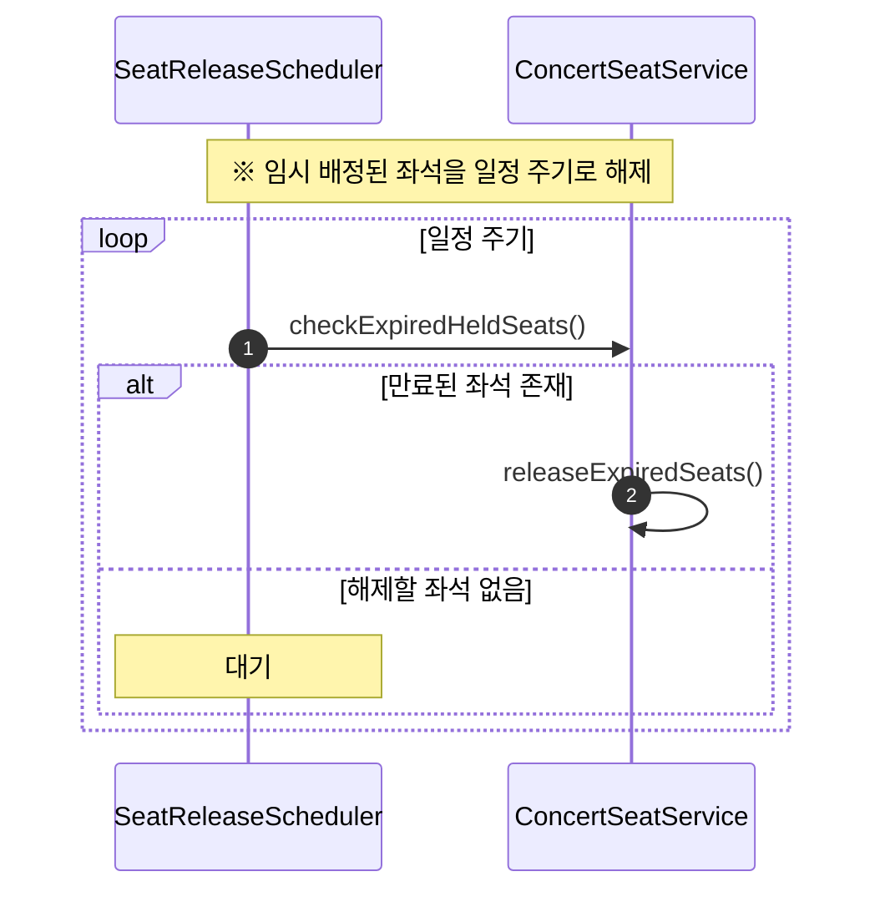
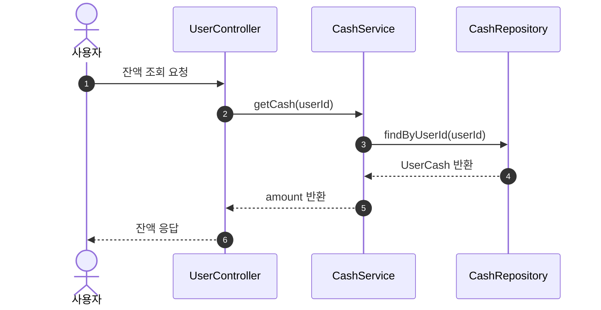
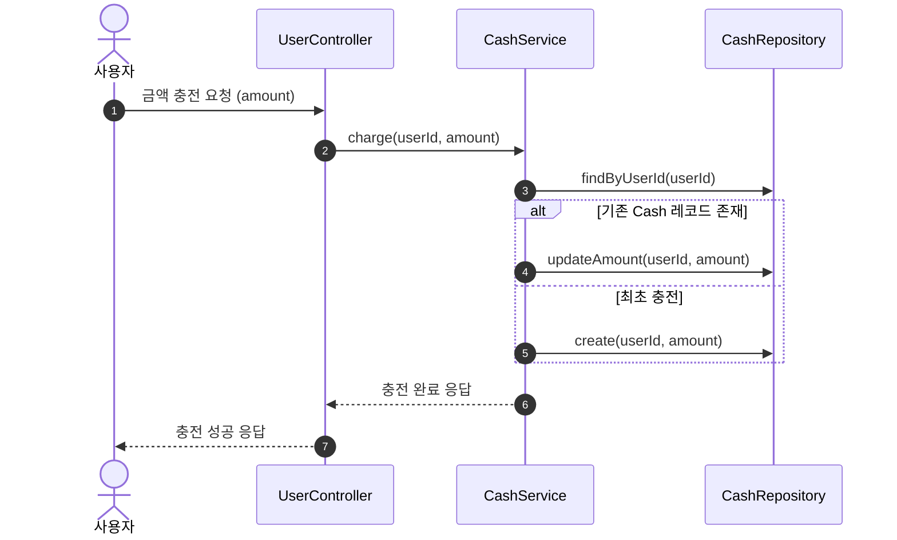
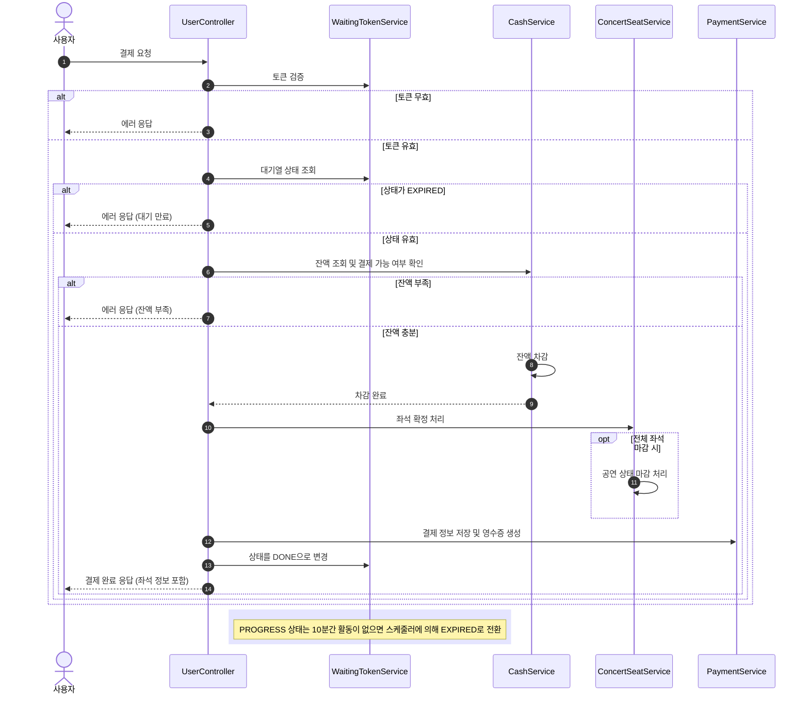

## 시퀀스 다이어그램

유저 대기열 토큰 기능

- 사용자는 5초 간격으로 대기열 상태를 조회합니다.
- 시스템은 대기 순번과 상태를 기준으로 진입 가능 여부를 판단합니다.
- 정원이 가득 찬 경우에는 사용자의 현재 대기 순번을 계산해 응답합니다.

예약 가능 날짜 조회 API

좌석 조회 API

- 사용자는 대기열 토큰을 포함해 좌석 정보를 요청합니다.
- 토큰이 유효한 경우에만 해당 공연 회차의 좌석 목록을 조회해 응답합니다

좌석 예약 요청 API

- 사용자는 날짜와 좌석 번호, 대기열 토큰을 포함하여 예약을 요청합니다.
- 해당 좌석이 예약 가능한 상태일 경우 5분간 임시 배정 처리합니다.

임시 배정 해제 스케줄러

잔액 조회 API

충전 API

결제 API

