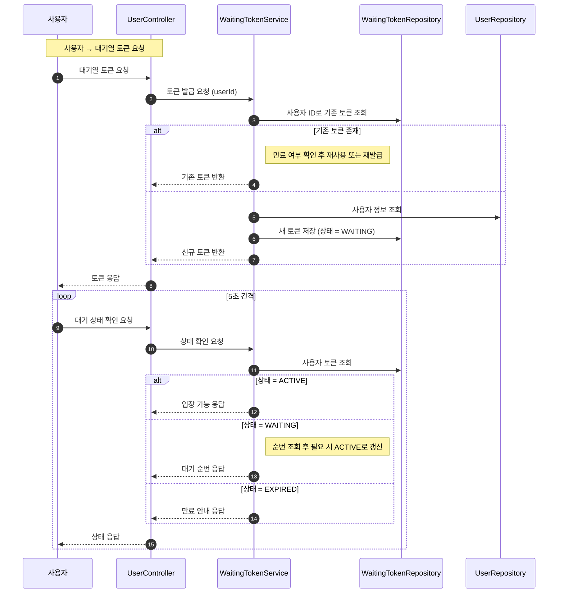
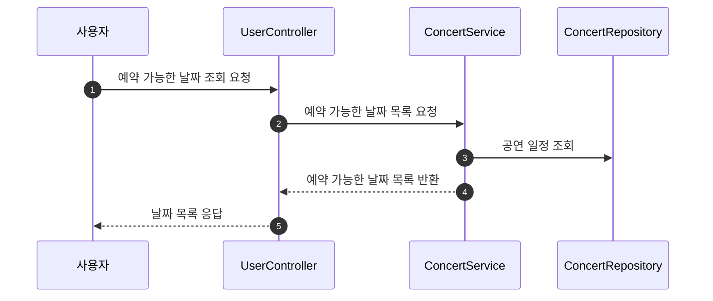
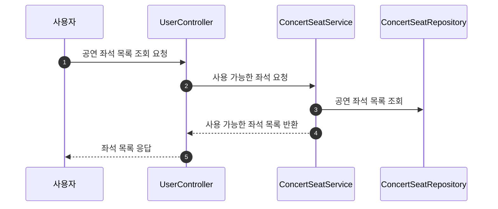
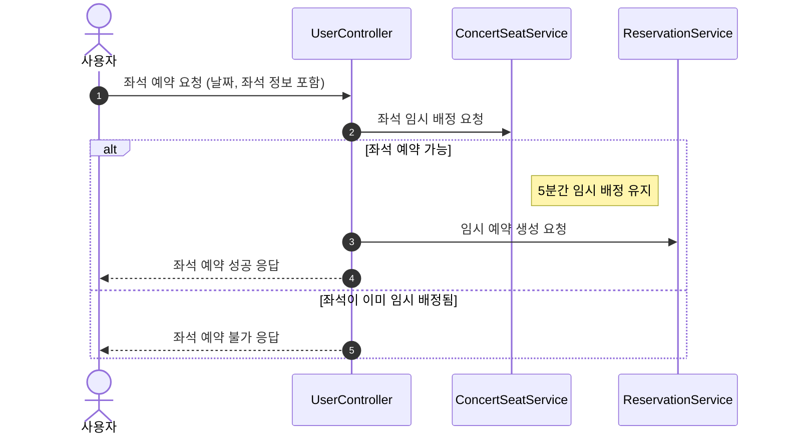
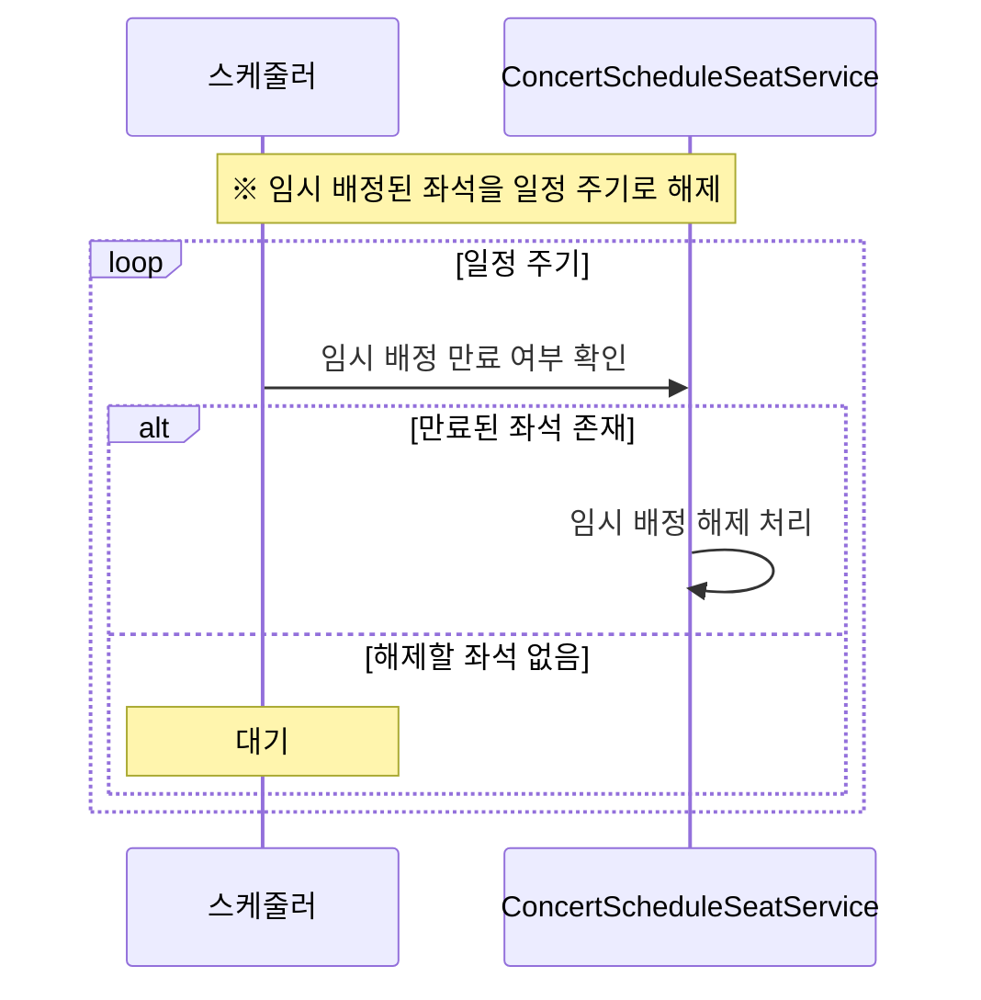
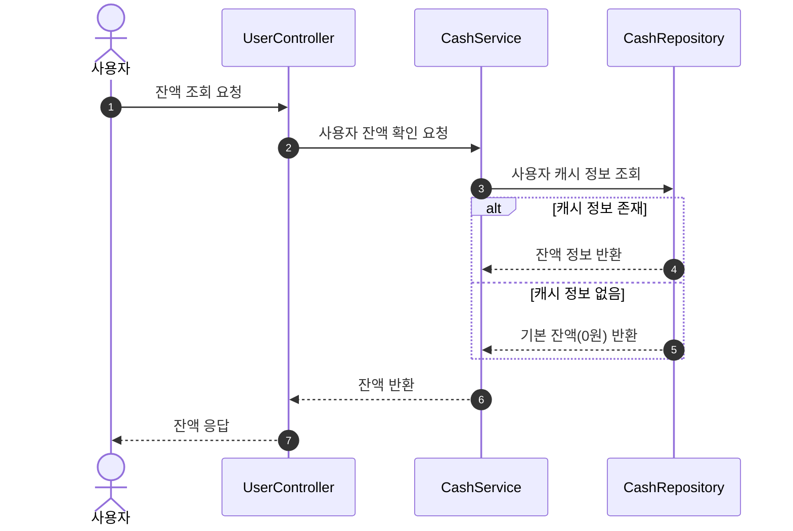
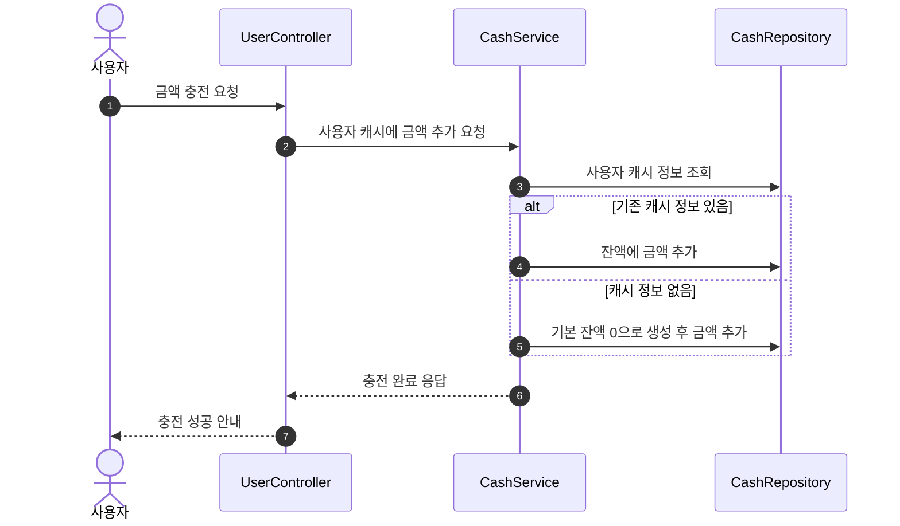
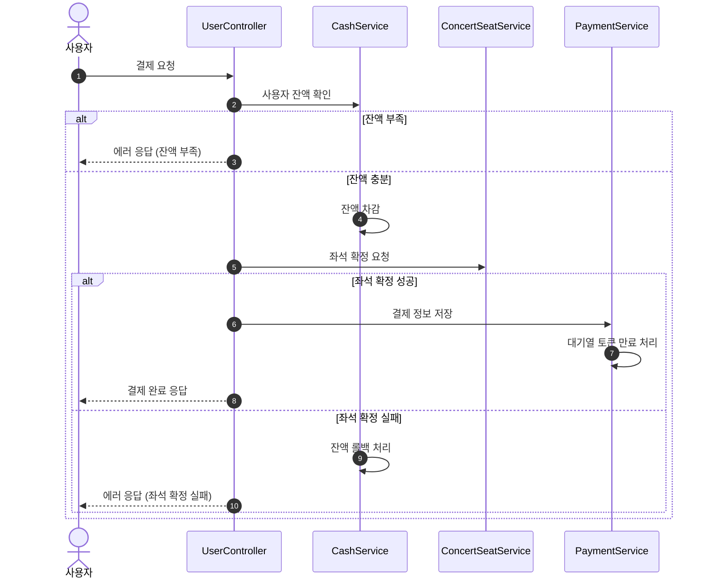

## 시퀀스 다이어그램

유저 대기열 토큰 기능

- 사용자는 5초 간격으로 대기열 상태를 조회합니다.
- 시스템은 사용자의 대기 순번과 토큰 상태를 기준으로 입장 가능 여부를 판단합니다.
- 정원이 가득 찬 경우에는 현재 대기 순번만 계산하여 응답합니다.

예약 가능 날짜 조회 API

- 사용자는 대기열 토큰을 포함해 예약 가능한 날짜를 요청합니다.
- 토큰이 유효한 경우에만 해당 콘서트의 예약 가능 일정을 조회해 응답합니다.

좌석 조회 API

- 사용자는 대기열 토큰을 포함해 좌석 정보를 요청합니다.
- 토큰이 유효한 경우에만 해당 콘서트의 회차의 좌석 목록을 조회해 응답합니다.

좌석 예약 요청 API

- 사용자는 날짜와 좌석 번호, 대기열 토큰을 포함해 좌석 예약을 요청합니다.
- 토큰이 유효하고 좌석이 예약 가능한 경우, 해당 좌석을 5분간 임시로 배정하며 예약 요청을 완료합니다.

임시 배정 좌석 해제 스케줄러

잔액 조회 API

- 이 API는 대기열 토큰 없이도 호출 가능하며 사용자 ID를 통해 잔액 정보를 반환합니다.

충전 API

- 사용자는 금액을 입력해 자신의 잔액을 충전할 수 있습니다.
- 시스템은 사용자 ID를 기반으로 캐시 정보를 조회하고 기존 정보가 없을 경우 기본 잔액 0으로 새로 생성한 뒤 충전 금액을 추가합니다.

결제 API

- 사용자는 유효한 대기열 토큰을 포함하여 결제를 요청할 수 있습니다.
- 시스템은 사용자 잔액을 확인하고, 잔액이 충분한 경우에만 좌석을 확정하고 결제 처리를 진행합니다.
- 결제가 완료되면 좌석 소유권이 확정되고, 대기열 토큰은 만료 처리됩니다.
- 좌석 확정에 실패할 경우 잔액은 롤백되며, 결제는 진행되지 않습니다.

