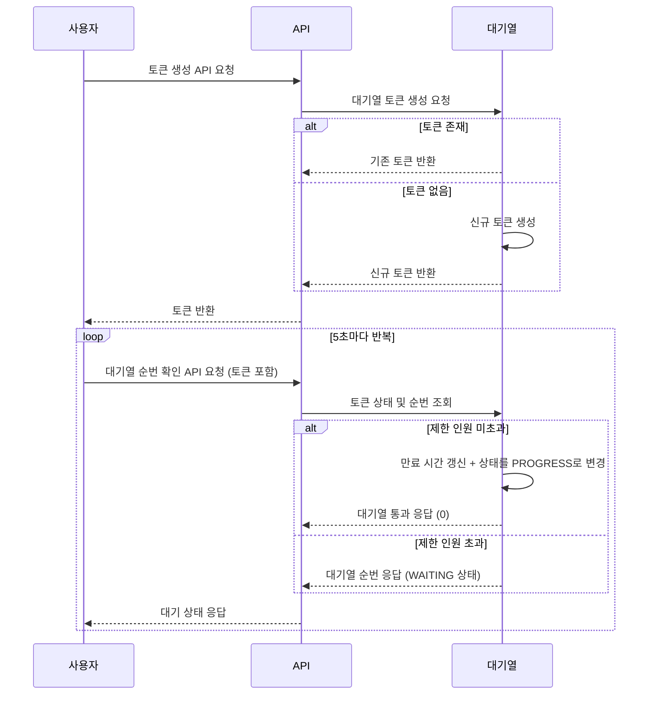
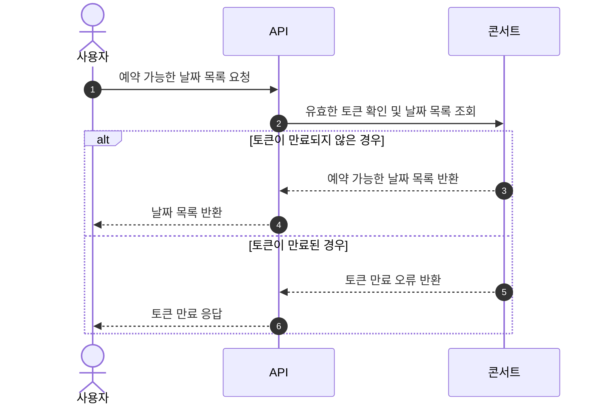
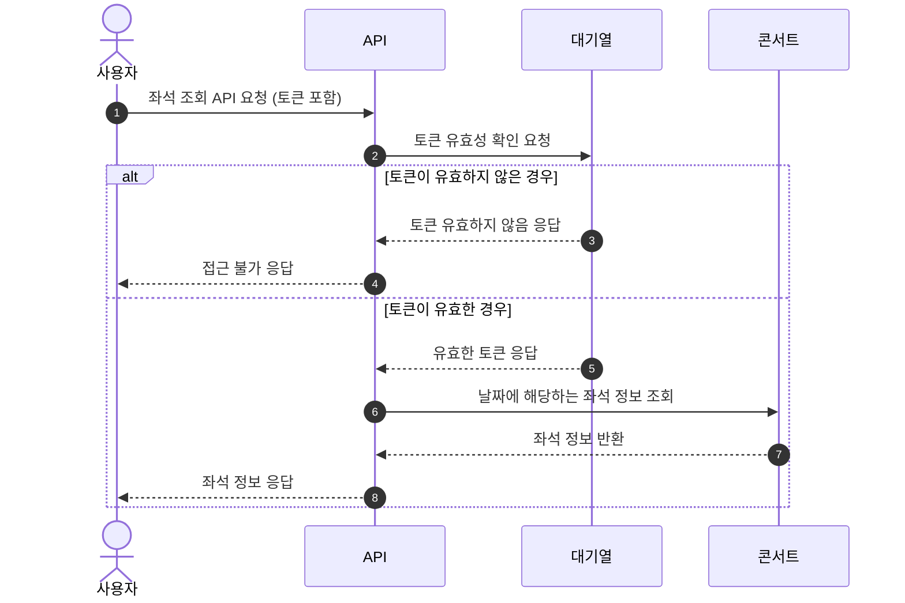
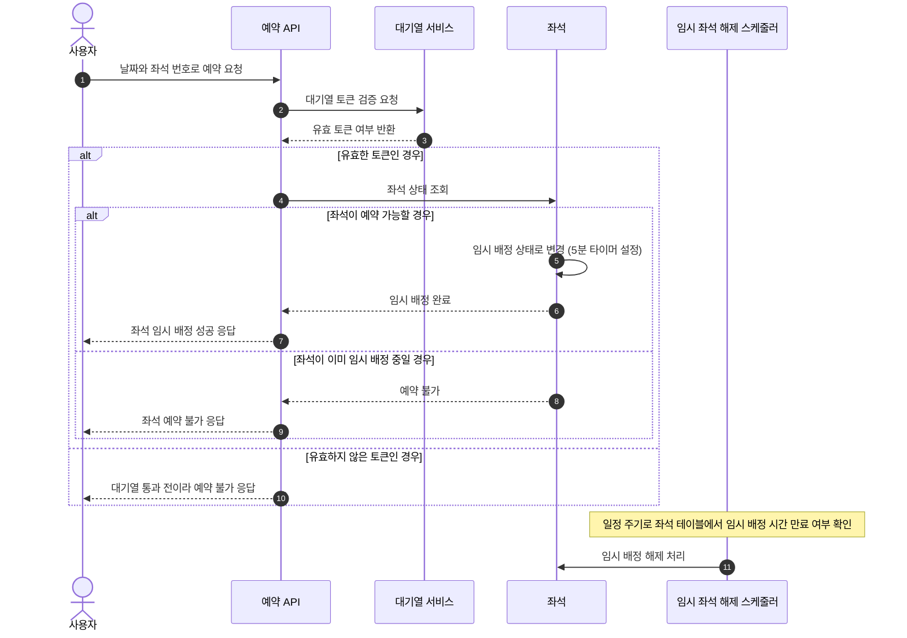
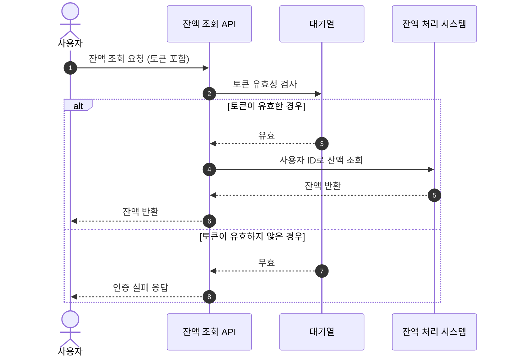

## 시퀀스 다이어그램

유저 대기열 토큰 기능

- 5초 간격으로 대기열 상태를 확인하며, 대기 순번과 상태에 따라 진입 가능 여부를 판단합니다.
- 정원이 가득 찬 경우에는 사용자의 대기 순번을 계산해 알려줍니다.

```mermaid
sequenceDiagram
    participant 사용자
    participant API
    participant 대기열

    사용자->>API: 토큰 생성 API 요청
    API->>대기열: 대기열 토큰 생성 요청
    alt 토큰 존재
        대기열-->>API: 기존 토큰 반환
    else 토큰 없음
        대기열->>대기열: 신규 토큰 생성
        대기열-->>API: 신규 토큰 반환
    end
    API-->>사용자: 토큰 반환

    loop 5초마다 반복
        사용자->>API: 대기열 순번 확인 API 요청 (토큰 포함)
        API->>대기열: 토큰 상태 및 순번 조회
        alt 제한 인원 미초과
            대기열->>대기열: 만료 시간 갱신 + 상태를 PROGRESS로 변경
            대기열-->>API: 대기열 통과 응답 (0)
        else 제한 인원 초과
            대기열-->>API: 대기열 순번 응답 (WAITING 상태)
        end
        API-->>사용자: 대기 상태 응답
    end
```

예약 가능 날짜 조회 API

```mermaid
sequenceDiagram
    autonumber
    actor 사용자 as 사용자
    participant API as API
    participant 콘서트 as 콘서트

    사용자 ->> API: 예약 가능한 날짜 목록 요청
    API ->> 콘서트: 유효한 토큰 확인 및 날짜 목록 조회

    alt 토큰이 만료되지 않은 경우
        콘서트 -->> API: 예약 가능한 날짜 목록 반환
        API -->> 사용자: 날짜 목록 반환
    else 토큰이 만료된 경우
        콘서트 -->> API: 토큰 만료 오류 반환
        API -->> 사용자: 토큰 만료 응답
    end
```

좌석 조회 API

```mermaid
sequenceDiagram
    autonumber
    actor 사용자 as 사용자
    participant API as API
    participant 대기열 as 대기열
    participant 콘서트 as 콘서트

    사용자 ->> API: 좌석 조회 API 요청 (토큰 포함)
    API ->> 대기열: 토큰 유효성 확인 요청
    alt 토큰이 유효하지 않은 경우
        대기열 -->> API: 토큰 유효하지 않음 응답
        API -->> 사용자: 접근 불가 응답
    else 토큰이 유효한 경우
        대기열 -->> API: 유효한 토큰 응답
        API ->> 콘서트: 날짜에 해당하는 좌석 정보 조회
        콘서트 -->> API: 좌석 정보 반환
        API -->> 사용자: 좌석 정보 응답
    end
```

좌석 예약 요청 API

```mermaid
sequenceDiagram
    autonumber
    actor 사용자
    participant API as 예약 API
    participant 대기열 as 대기열 서비스
    participant 좌석 as 좌석
    participant 스케줄러 as 임시 좌석 해제 스케줄러

    사용자 ->> API: 날짜와 좌석 번호로 예약 요청
    API ->> 대기열: 대기열 토큰 검증 요청
    대기열 -->> API: 유효 토큰 여부 반환

    alt 유효한 토큰인 경우
        API ->> 좌석: 좌석 상태 조회
        alt 좌석이 예약 가능할 경우
            좌석 ->> 좌석: 임시 배정 상태로 변경 (5분 타이머 설정)
            좌석 -->> API: 임시 배정 완료
            API -->> 사용자: 좌석 임시 배정 성공 응답
        else 좌석이 이미 임시 배정 중일 경우
            좌석 -->> API: 예약 불가
            API -->> 사용자: 좌석 예약 불가 응답
        end
    else 유효하지 않은 토큰인 경우
        API -->> 사용자: 대기열 통과 전이라 예약 불가 응답
    end

    note over 스케줄러: 일정 주기로 좌석 테이블에서 임시 배정 시간 만료 여부 확인
    스케줄러 ->> 좌석: 임시 배정 해제 처리
```

잔액 조회 API

```mermaid
sequenceDiagram
    autonumber
    actor 사용자 as 사용자
    participant API as 잔액 조회 API
    participant 대기열 as 대기열
    participant 잔액 as 잔액 처리 시스템

    사용자 ->> API: 잔액 조회 요청 (토큰 포함)
    API ->> 대기열: 토큰 유효성 검사
    alt 토큰이 유효한 경우
        대기열 -->> API: 유효
        API ->> 잔액: 사용자 ID로 잔액 조회
        잔액 -->> API: 잔액 반환
        API -->> 사용자: 잔액 반환
    else 토큰이 유효하지 않은 경우
        대기열 -->> API: 무효
        API -->> 사용자: 인증 실패 응답
    end
```

