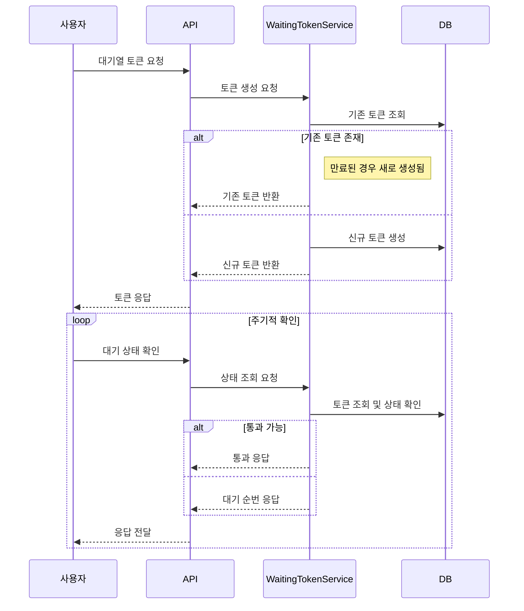
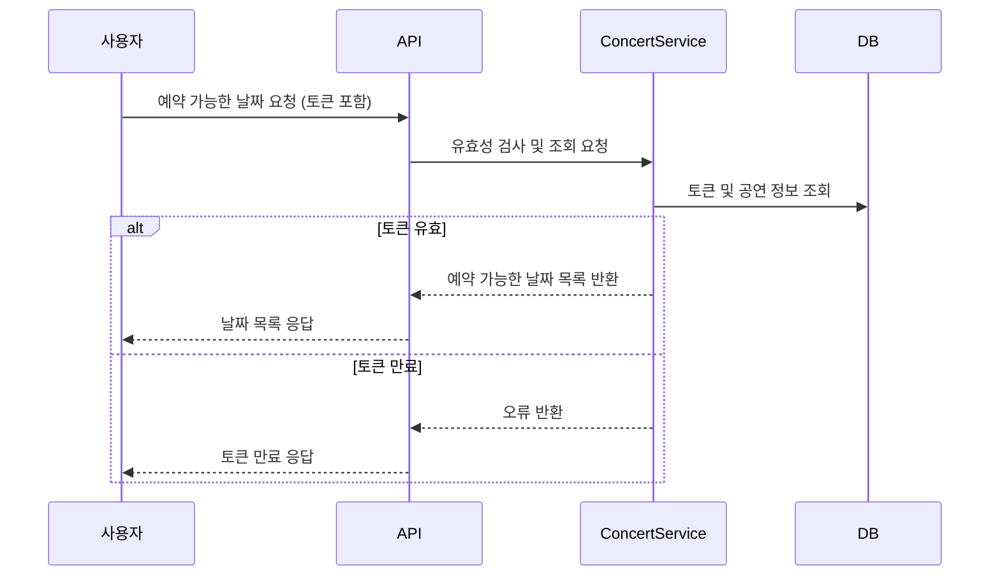
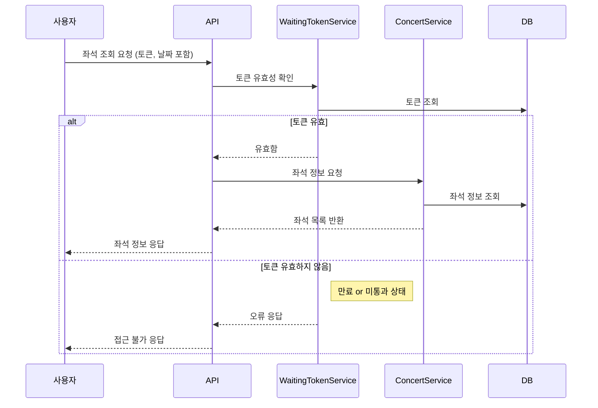

## 시퀀스 다이어그램

유저 대기열 토큰 기능

- 사용자는 5초 간격으로 대기열 상태를 조회하며 시스템은 대기 순번과 상태를 기준으로 진입 가능 여부를 판단합니다.
- 정원이 가득 찬 경우에는 사용자의 현재 대기 순번을 계산해 응답합니다.

```mermaid
sequenceDiagram
    participant 사용자
    participant API
    participant WaitingTokenService
    participant DB

    사용자->>API: 대기열 토큰 요청
    API->>WaitingTokenService: 토큰 생성 요청
    WaitingTokenService->>DB: 기존 토큰 조회
    alt 기존 토큰 존재
        note right of WaitingTokenService: 만료된 경우 새로 생성됨
        WaitingTokenService-->>API: 기존 토큰 반환
    else
        WaitingTokenService->>DB: 신규 토큰 생성
        WaitingTokenService-->>API: 신규 토큰 반환
    end
    API-->>사용자: 토큰 응답

    loop 주기적 확인
        사용자->>API: 대기 상태 확인
        API->>WaitingTokenService: 상태 조회 요청
        WaitingTokenService->>DB: 토큰 조회 및 상태 확인
        alt 통과 가능
            WaitingTokenService-->>API: 통과 응답
        else
            WaitingTokenService-->>API: 대기 순번 응답
        end
        API-->>사용자: 응답 전달
    end
```

예약 가능 날짜 조회 API

```mermaid
sequenceDiagram
    participant 사용자
    participant API
    participant ConcertService
    participant DB

    사용자->>API: 예약 가능한 날짜 요청 (토큰 포함)
    API->>ConcertService: 유효성 검사 및 조회 요청
    ConcertService->>DB: 토큰 및 공연 정보 조회
    alt 토큰 유효
        ConcertService-->>API: 예약 가능한 날짜 목록 반환
        API-->>사용자: 날짜 목록 응답
    else 토큰 만료
        ConcertService-->>API: 오류 반환
        API-->>사용자: 토큰 만료 응답
    end
```

좌석 조회 API

- 사용자는 대기열 토큰을 포함해 좌석 정보를 요청합니다.
- 토큰이 유효한 경우에만 해당 공연 회차의 좌석 목록을 조회해 응답합니다

```mermaid
sequenceDiagram
    participant 사용자
    participant API
    participant WaitingTokenService
    participant ConcertService
    participant DB

    사용자->>API: 좌석 조회 요청 (토큰, 날짜 포함)
    API->>WaitingTokenService: 토큰 유효성 확인
    WaitingTokenService->>DB: 토큰 조회
    alt 토큰 유효
        WaitingTokenService-->>API: 유효함
        API->>ConcertService: 좌석 정보 요청
        ConcertService->>DB: 좌석 정보 조회
        ConcertService-->>API: 좌석 목록 반환
        API-->>사용자: 좌석 정보 응답
    else 토큰 유효하지 않음
        note right of WaitingTokenService: 만료 or 미통과 상태
        WaitingTokenService-->>API: 오류 응답
        API-->>사용자: 접근 불가 응답
    end
```

