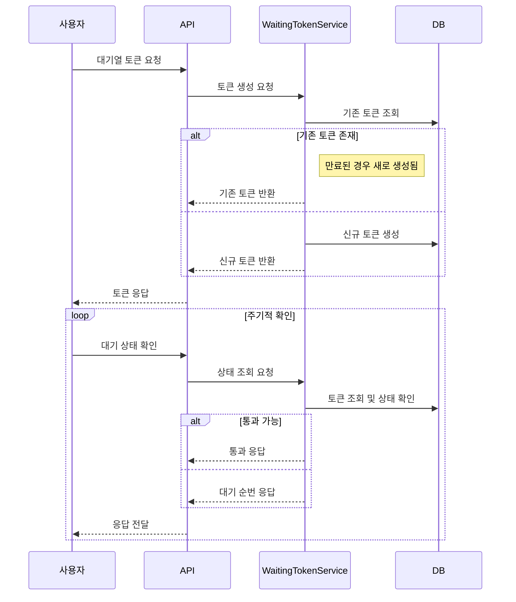
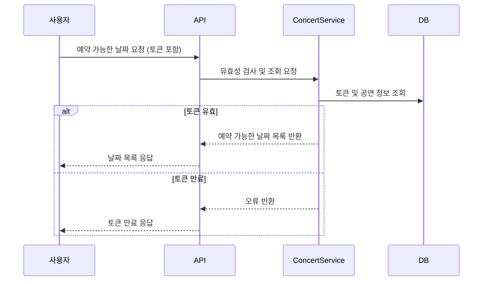

## 시퀀스 다이어그램

유저 대기열 토큰 기능

✅ 대기열 토큰 발급 API 
- 사용자가 진입 시 토큰을 요청하면 서버는 기존 토큰을 조회하고 
- 유효하면 그대로 반환 
- 만료되었거나 없으면 새로 생성

✅ 대기열 상태 확인 API 
- 사용자는 주기적으로 상태를 조회하고 서버는 토큰의 순번과 상태를 확인해
- 순번 도달 시 통과 응답
- 그 외엔 현재 대기 순번 응답

```mermaid
sequenceDiagram
    participant 사용자
    participant API
    participant WaitingTokenService
    participant DB

    사용자->>API: 대기열 토큰 요청
    API->>WaitingTokenService: 토큰 생성 요청
    WaitingTokenService->>DB: 기존 토큰 조회
    alt 기존 토큰 존재
        note right of WaitingTokenService: 만료된 경우 새로 생성됨
        WaitingTokenService-->>API: 기존 토큰 반환
    else
        WaitingTokenService->>DB: 신규 토큰 생성
        WaitingTokenService-->>API: 신규 토큰 반환
    end
    API-->>사용자: 토큰 응답

    loop 주기적 확인
        사용자->>API: 대기 상태 확인
        API->>WaitingTokenService: 상태 조회 요청
        WaitingTokenService->>DB: 토큰 조회 및 상태 확인
        alt 통과 가능
            WaitingTokenService-->>API: 통과 응답
        else
            WaitingTokenService-->>API: 대기 순번 응답
        end
        API-->>사용자: 응답 전달
    end
```

예약 가능 날짜 조회 API

```mermaid
sequenceDiagram
    participant 사용자
    participant API
    participant ConcertService
    participant DB

    사용자->>API: 예약 가능한 날짜 요청 (토큰 포함)
    API->>ConcertService: 유효성 검사 및 조회 요청
    ConcertService->>DB: 토큰 및 공연 정보 조회
    alt 토큰 유효
        ConcertService-->>API: 예약 가능한 날짜 목록 반환
        API-->>사용자: 날짜 목록 응답
    else 토큰 만료
        ConcertService-->>API: 오류 반환
        API-->>사용자: 토큰 만료 응답
    end
```

