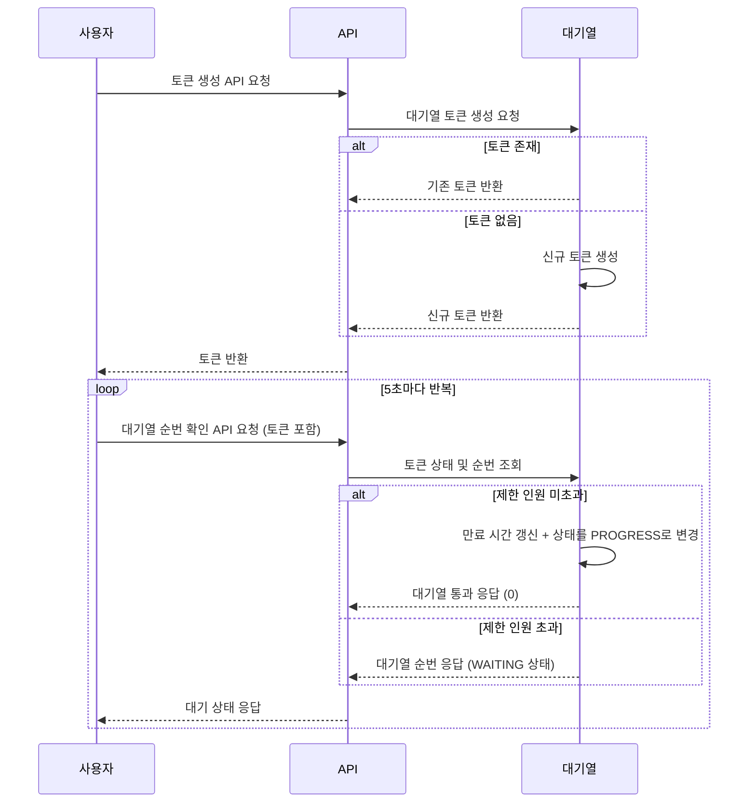

## 시퀀스 다이어그램

유저 대기열 토큰 기능

- 5초 간격으로 대기열 상태를 확인하며, 대기 순번과 상태에 따라 진입 가능 여부를 판단합니다.
- 정원이 가득 찬 경우에는 사용자의 대기 순번을 계산해 알려줍니다.

```mermaid
sequenceDiagram
    participant 사용자
    participant API
    participant 대기열

    사용자->>API: 토큰 생성 API 요청
    API->>대기열: 대기열 토큰 생성 요청
    alt 토큰 존재
        대기열-->>API: 기존 토큰 반환
    else 토큰 없음
        대기열->>대기열: 신규 토큰 생성
        대기열-->>API: 신규 토큰 반환
    end
    API-->>사용자: 토큰 반환

    loop 5초마다 반복
        사용자->>API: 대기열 순번 확인 API 요청 (토큰 포함)
        API->>대기열: 토큰 상태 및 순번 조회
        alt 제한 인원 미초과
            대기열->>대기열: 만료 시간 갱신 + 상태를 PROGRESS로 변경
            대기열-->>API: 대기열 통과 응답 (0)
        else 제한 인원 초과
            대기열-->>API: 대기열 순번 응답 (WAITING 상태)
        end
        API-->>사용자: 대기 상태 응답
    end
```

